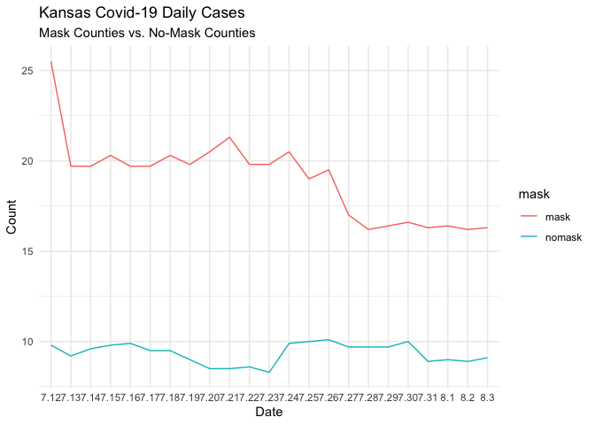
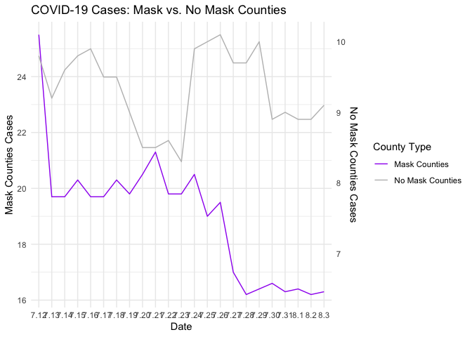

Lab 07 - Conveying the right message through visualisation
================
Yuxin Xie
2/22/2025

### Load packages and data

``` r
library(tidyverse) 
```

### 1

``` r
df <- tribble(
  ~date, ~count, ~mask,
  "7.12", 25.5, "mask",
  "7.13", 19.7, "mask",
  "7.14", 19.7,"mask",
  "7.15", 20.3,"mask",
  "7.16", 19.7,"mask",
  "7.17", 19.7,"mask",
  "7.18", 20.3,"mask",
  "7.19", 19.8,"mask",
  "7.20", 20.5,"mask",
  "7.21", 21.3,"mask",
  "7.22", 19.8,"mask",
  "7.23", 19.8,"mask",
  "7.24", 20.5,"mask",
  "7.25", 19,"mask",
  "7.26", 19.5,"mask",
  "7.27", 17,"mask",
  "7.28", 16.2,"mask",
  "7.29", 16.4,"mask",
  "7.30", 16.6,"mask",
  "7.31", 16.3,"mask",
  "8.1", 16.4,"mask",
  "8.2", 16.2,"mask",
  "8.3", 16.3,"mask",
  "7.12", 9.8, "nomask",
  "7.13", 9.2, "nomask",
  "7.14",9.6 ,"nomask",
  "7.15", 9.8,"nomask",
  "7.16", 9.9,"nomask",
  "7.17", 9.5,"nomask",
  "7.18", 9.5,"nomask",
  "7.19", 9,"nomask",
  "7.20", 8.5,"nomask",
  "7.21", 8.5,"nomask",
  "7.22", 8.6,"nomask",
  "7.23", 8.3,"nomask",
  "7.24",9.9 ,"nomask",
  "7.25", 10,"nomask",
  "7.26",10.1 ,"nomask",
  "7.27",9.7 ,"nomask",
  "7.28", 9.7,"nomask",
  "7.29", 9.7,"nomask",
  "7.30",10 ,"nomask",
  "7.31",8.9 ,"nomask",
  "8.1", 9,"nomask",
  "8.2", 8.9,"nomask",
  "8.3", 9.1,"nomask",
  )
```

### 2

``` r
ggplot(df, aes(x = date, y = count, group  = mask)) +
  geom_line(aes(color = mask))+
  labs(title = "Kansas Covid-19 Daily Cases",
       subtitle = "Mask Counties vs. No-Mask Counties",
       x = "Date",
       y = "Count") +
  theme_minimal()
```

<!-- --> the original
chart is misleading because the left Y-axis (for Mask Counties) ranges
from 15 to 25+.the right Y-axis (for No-Mask Counties) ranges from 4 to
14.

### 3

My visualization (the bar chart) presents the data in a clearer and more
honest way compared to the original line chart. The original chart is
misleading because the left Y-axis (for Mask Counties) ranges from 15 to
25+.the right Y-axis (for No-Mask Counties) ranges from 4 to 14. My
chart visually display the differences of the cases count more clearly.

### 4

Mask-wearing counties started with higher case rates but showed a steady
decline. No-mask counties had lower case rates and remained relatively
stable.

Using the same dataset you constructed, your goal now is to create a new
visualization that intentionally conveys the opposite message of your
previous, accurate visualization. This exercise is designed to highlight
the impact of visualization choices on the interpretation of data. It’s
a practical exploration of how changing the presentation can alter the
perceived message, underscoring the ethical implications of data
visualization.

### 5

The accurate visualization uses a single y axis for mask and nonmask
groups. The x-axis represents time from July 12 to August 3, 2020. the
line chart shows changes over time.

### 6

Convery the opposite message, mask mandates were unnecessary. we can use
the dual y aixs with different scales. We can also use bar chart instead
of a line chart

### 7

``` r
# Create a misleading dual y-axis line chart

df_2 <- tribble(
  ~date, ~mask, ~nomask, 
  "7.12", 25.5, 9.8,
  "7.13", 19.7, 9.2,
  "7.14", 19.7,9.6,
  "7.15", 20.3,9.8,
  "7.16", 19.7,9.9,
  "7.17", 19.7,9.5,
  "7.18", 20.3,9.5,
  "7.19", 19.8,9,
  "7.20", 20.5,8.5,
  "7.21", 21.3,8.5,
  "7.22", 19.8,8.6,
  "7.23", 19.8,8.3,
  "7.24", 20.5,9.9,
  "7.25", 19,10,
  "7.26", 19.5, 10.1,
  "7.27", 17,9.7,
  "7.28", 16.2,9.7,
  "7.29", 16.4, 10,
  "7.30", 16.6, 8.9,
  "7.31", 16.3, 9,
  "8.1", 16.4, 8.9,
  "8.2", 16.2, 8.9,
  "8.3", 16.3, 9.1,
  )
```

``` r
scale_factor <- max(df_2$mask) / max(df_2$nomask)

ggplot(df_2, aes(x = date)) +
  geom_line(aes(y = mask, color = "Mask Counties"), group = 1) +
  geom_line(aes(y = nomask * scale_factor, color = "No Mask Counties"), group = 1) +
  scale_y_continuous(
    name = "Mask Counties Cases",
    sec.axis = sec_axis(~ . / scale_factor, name = "No Mask Counties Cases")
  ) +
  scale_color_manual(name = "County Type", values = c("Mask Counties" = "purple", "No Mask Counties" = "grey")) +
  labs(title = "COVID-19 Cases: Mask vs. No Mask Counties",
       x = "Date") +
  theme_minimal()
```

<!-- -->
